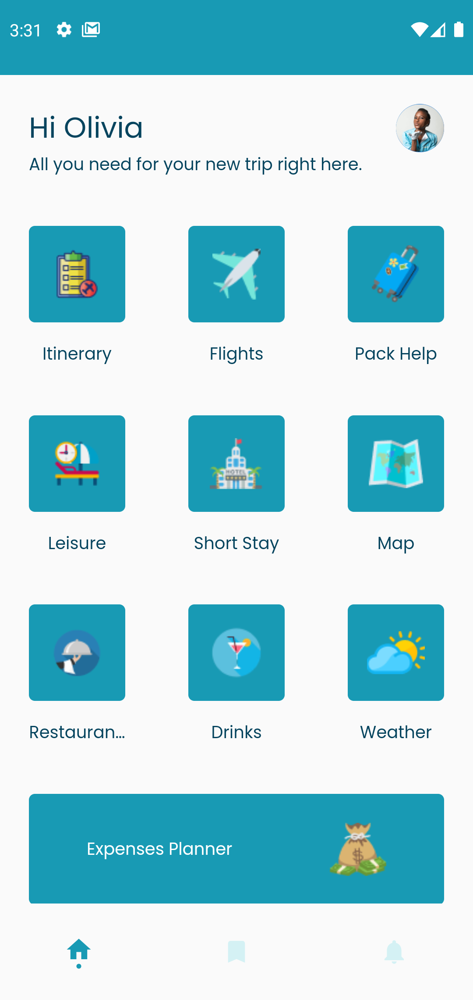
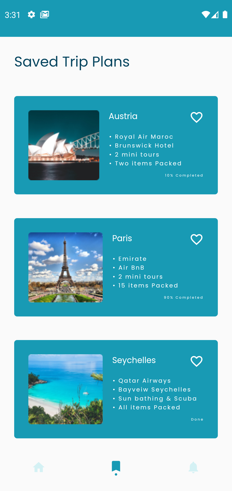
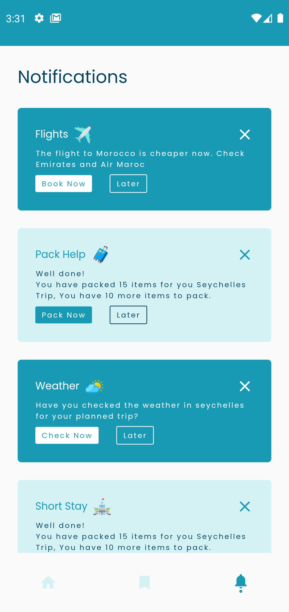
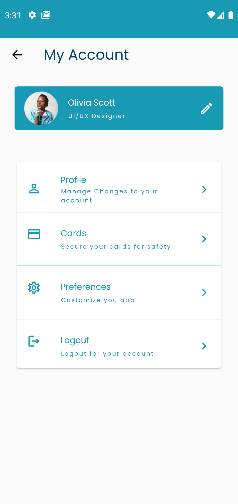

# Trips - Travel Planning Made Easy


Trips is a Flutter application designed to help users organize and plan their travels effectively. With an intuitive interface and comprehensive features, it makes trip planning a breeze.

## Features

- **Trip Creation**: Easily create and manage your upcoming trips
- **Itinerary Planning**: Plan your daily activities and schedule
- **Expense Tracking**: Keep track of your travel expenses
- **Weather Information**: Check weather forecasts for your destinations
- **Packing Assistant**: Never forget essential items with packing lists
- **Flight Information**: Store and manage flight details
- **Restaurant & Activity Planning**: Save places to eat and things to do
- **Map Integration**: Visualize your travel destinations

## Screenshots

<div style="display: flex; justify-content: space-between;">
    
    
    
    
    
</div>

## Getting Started

### Prerequisites

- Flutter SDK (>=2.17.6)
- Dart SDK
- Android Studio / VS Code
- Android SDK / Xcode (for iOS development)

### Installation

1. Clone the repository:
   ```bash
   git clone https://github.com/yourusername/trips.git
   ```

2. Navigate to the project directory:
   ```bash
   cd trips
   ```

3. Install dependencies:
   ```bash
   flutter pub get
   ```

4. Run the app:
   ```bash
   flutter run
   ```

## Dependencies

- `google_fonts: ^3.0.1` - For custom fonts
- `flutter_svg: ^1.1.4` - For SVG image support
- `collection: ^1.16.0` - For collection utilities
- `cupertino_icons: ^1.0.2` - For iOS-style icons

## Project Structure

```
lib/
├── data/
│   └── model/         # Data models
├── presentation/
│   ├── core/          # Core utilities
│   ├── screens/       # App screens
│   └── widgets/       # Reusable widgets
└── main.dart          # Entry point
```

## Contributing

Contributions are welcome! Please feel free to submit a Pull Request.

## License

This project is licensed under the MIT License - see the [LICENSE](LICENSE) file for details.

## Acknowledgments

- Thanks to all contributors who have helped shape Trips
- Special thanks to the Flutter team for the amazing framework
